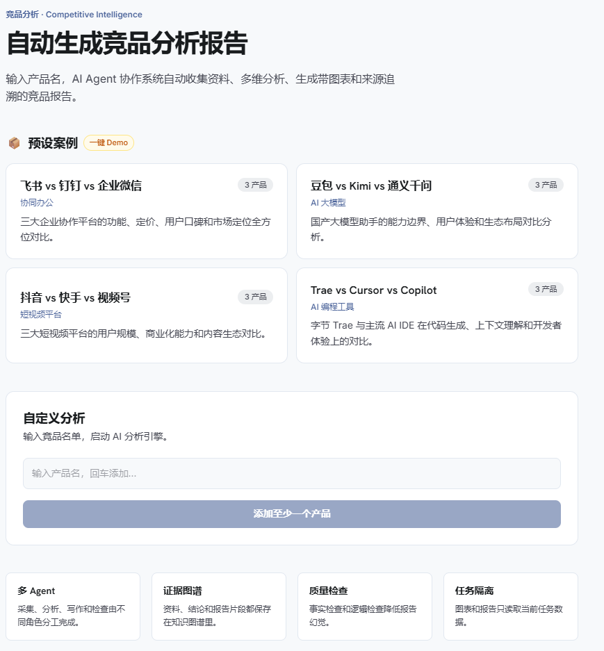
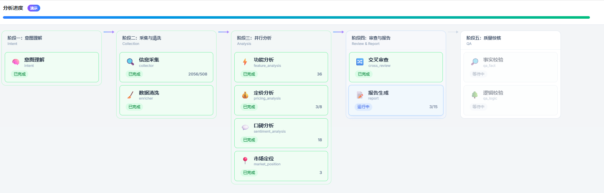
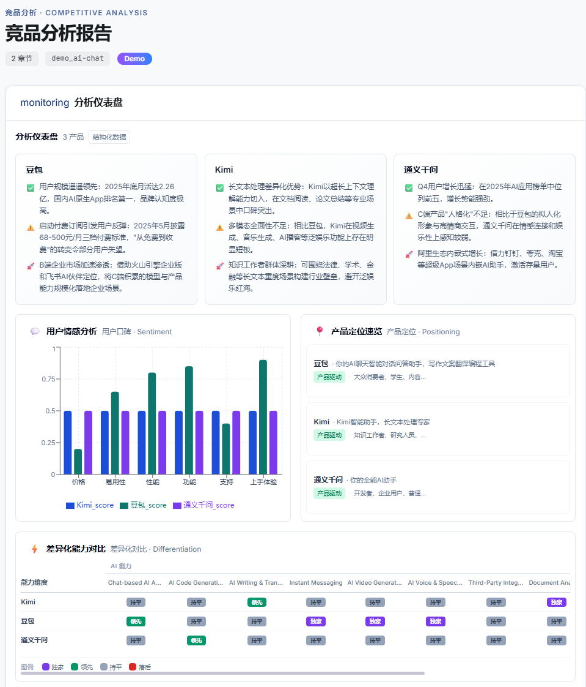
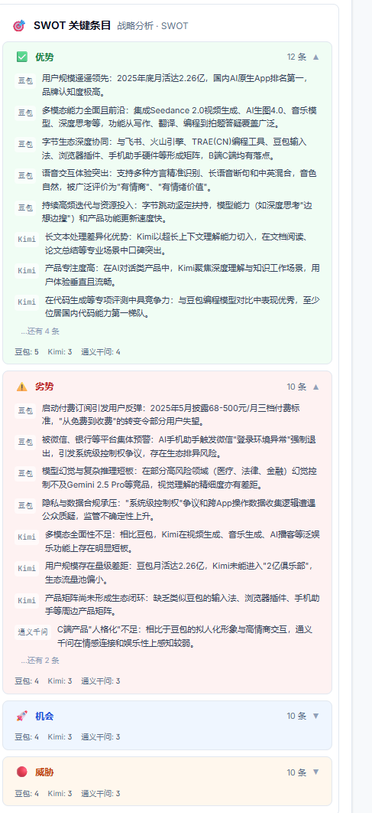
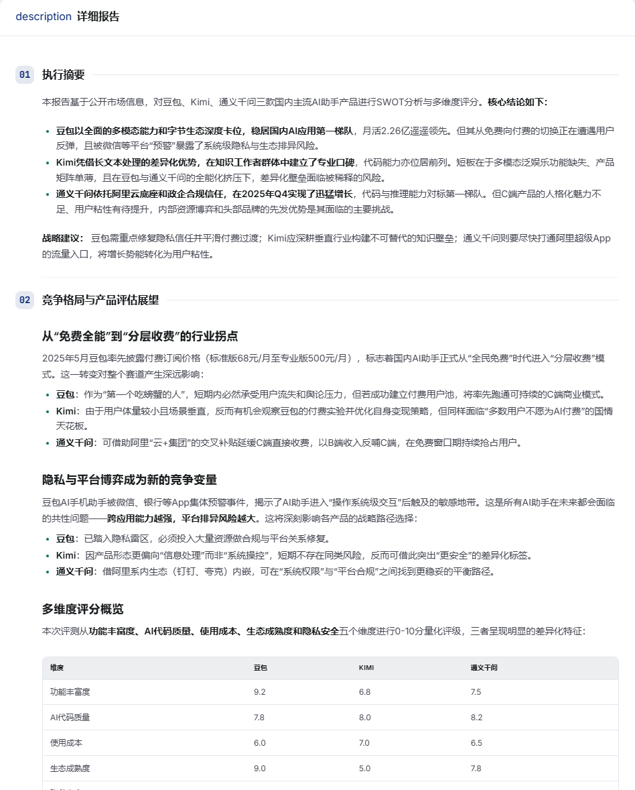
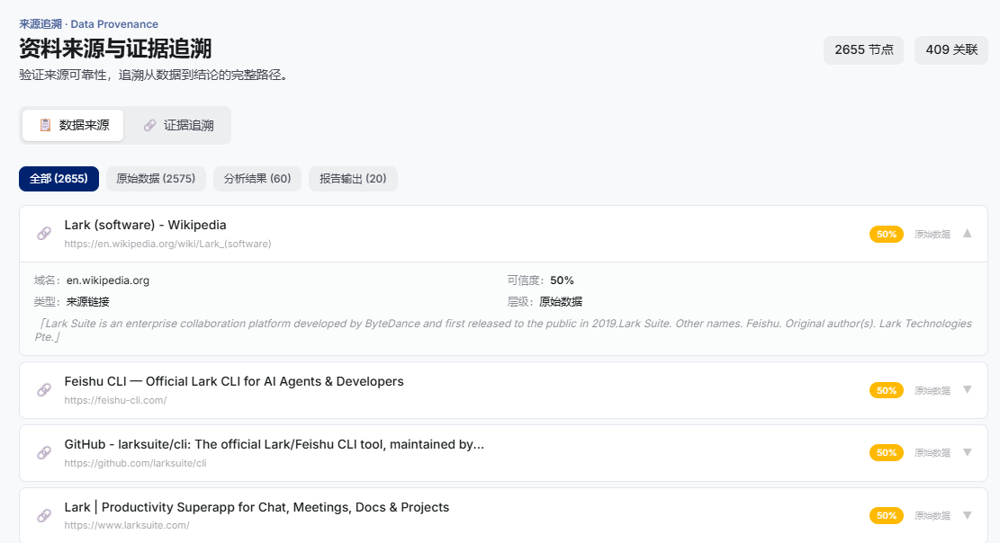
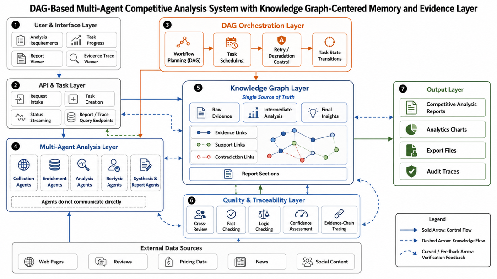
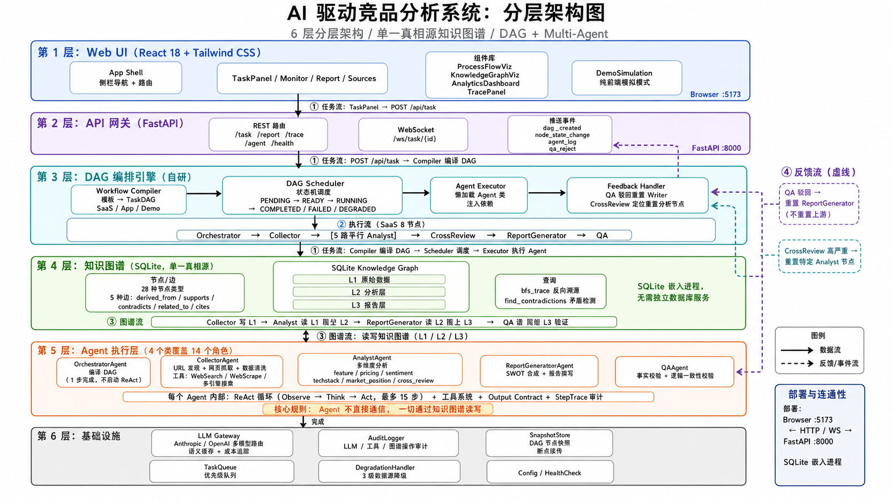

# 🏗️ 基于 DAG 知识图谱的多 Agent 竞品分析系统

> **14 个专业 Agent 协同工作 · 分层知识图谱 · DAG 有向无环图编排引擎 · 全链路证据可追溯**

<p align="center">
  
</p>

<p align="center">
  
  
  
  
  
  
  
  
</p>

---

## 📖 项目简介

输入一个产品名称或竞品范围，系统会自动 **收集公开资料 → 多维度分析 → 交叉验证 → 生成带图表和来源的竞品分析报告**。整个流程由 14 个专业 Agent 分工协作完成，所有结论均可追溯原始数据来源，不再有「黑箱报告」的问题。

### 🎯 适合谁用

- 🕵️ **产品经理** — 快速了解竞品动态，生成标准化对比报告
- 📊 **市场分析师** — 批量分析多个竞品，节省 80% 资料收集时间
- 🎓 **AI / 全栈开发者** — 作品集展示、技术面试演示、比赛提交

### ✨ 核心亮点

| ⭐ 亮点 | 说明 |
|---------|------|
| 🧠 **14 Agent 协作** | 从编排、采集、分析、评审、撰写到质检，全流程专业化分工 |
| 🔗 **全链路可追溯** | 每条结论标注数据来源 URL，支持一键跳转查看原始资料 |
| 🏗️ **三层知识图谱** | 资料层 → 证据层 → 结论层，Agent 间通过图谱而非直接通信 |
| 🔄 **双重质量闭环** | Cross Review 横向交叉验证 + QA 纵向质检，不合格自动打回重做 |
| ⚡ **DAG 编排引擎** | 支持条件分支、循环反馈、断点续传、下游级联失效 |
| 🎨 **可视化报告** | SWOT 矩阵、功能对比图、情感雷达图、特性热力图自动生成 |
| 💰 **语义缓存** | LLM 调用自动语义缓存，重复 Demo 零成本 |

---

## 🖼️ 功能预览

### 🎯 任务创建面板

<p align="center">
  
</p>

4 个预设 Demo 一键启动，支持自定义竞品输入。

---

### 📊 实时 DAG 阶段分析

<p align="center">
  
</p>

5 个分析阶段可视化，支持 Agent 实时状态追踪 + 执行日志。

---

### 📈 可视化图表报告

<p align="center">
  
</p>

自动生成竞品功能热力图、情感雷达图、SWOT 分析矩阵。

---

### 💡 SWOT 深度分析

<p align="center">
  
</p>

基于知识图谱证据的结构化 SWOT，每条结论标注来源产品。

---

### 📑 详细分析报告

<p align="center">
  
</p>

执行摘要、战略建议、客户选型建议等 10+ 个章节完整输出。

---

### 🔗 全链路数据来源追溯

<p align="center">
  
</p>

2600+ 个知识图谱节点可追溯原始 URL，支持一键跳转验证。

---

## 🏗️ 系统架构

### 分层架构总图

<p align="center">
  
</p>

### Agent 协作数据流图

<p align="center">
  
</p>

```
┌─────────────────────────────────────────────────────────────────┐
│                       🖥️  React 前端                            │
│          报告展示 · 实时进度 · 图表可视化 · PDF 下载              │
└──────────────────────────┬──────────────────────────────────────┘
                           │ WebSocket + REST API
┌──────────────────────────▼──────────────────────────────────────┐
│                    ⚡  FastAPI 后端                              │
│         Task Routes · Report API · WebSocket · Analytics        │
└──────────────────────────┬──────────────────────────────────────┘
                           │
┌──────────────────────────▼──────────────────────────────────────┐
│                📋  DAG 调度引擎 + 状态机                        │
│    串行/并行 · 条件分支 · 循环反馈 · 断点续传 · 级联失效        │
└──────────────────────────┬──────────────────────────────────────┘
                           │
┌──────────────────────────▼──────────────────────────────────────┐
│                  🤖  14 个 Agent 协作层                         │
│  ┌─────────┐ ┌──────────┐ ┌──────────┐ ┌──────────────────┐   │
│  │Orchestr.│ │Source    │ │Collector │ │Data Enricher     │   │
│  │ 编排     │ │Discovery │ │ 采集器×3 │ │ 数据清洗          │   │
│  └─────────┘ └──────────┘ └──────────┘ └──────────────────┘   │
│  ┌─────────┐ ┌──────────┐ ┌──────────┐ ┌──────────────────┐   │
│  │Feature  │ │Sentiment │ │Pricing   │ │Tech Stack        │   │
│  │ 功能分析 │ │ 情感分析  │ │ 定价分析  │ │ 技术栈分析        │   │
│  └─────────┘ └──────────┘ └──────────┘ └──────────────────┘   │
│  ┌─────────┐ ┌──────────┐ ┌──────────┐ ┌──────────────────┐   │
│  │Market   │ │Cross     │ │SWOT      │ │Writer            │   │
│  │ 市场定位 │ │ Review   │ │ 综合合成  │ │ 报告撰写          │   │
│  └─────────┘ └──────────┘ └──────────┘ └──────────────────┘   │
│  ┌────────────────────────────────────────────────────────┐    │
│  │ QA Fact Check · QA Logic Check 🛡️ 双重质检              │    │
│  └────────────────────────────────────────────────────────┘    │
└──────────────────────────┬──────────────────────────────────────┘
                           │ ReAct 循环 · 工具注册表
┌──────────────────────────▼──────────────────────────────────────┐
│                  🧠  三层知识图谱 (SQLite)                      │
│  ┌──────────┐    ┌──────────┐    ┌──────────┐                  │
│  │ 资料层    │ →  │ 证据层   │ →  │ 结论层   │                  │
│  │ 原始数据  │    │ 分析结果  │    │ 报告片段  │                  │
│  └──────────┘    └──────────┘    └──────────┘                  │
└──────────────────────────┬──────────────────────────────────────┘
                           │
┌──────────────────────────▼──────────────────────────────────────┐
│               🌐  LLM Gateway + 基础设施层                      │
│  语义缓存 · 成本追踪 · 审计日志 · Checkpoint · 任务队列 · 降级   │
└─────────────────────────────────────────────────────────────────┘
```

---

## 🤖 14 个 Agent 详解

| # | Agent | 职责 | 输入 | 输出 |
|:-:|-------|------|------|------|
| 1 | 🎯 **Orchestrator** | 任务拆解、DAG 生成、优先级分配 | 用户需求 | 完整的 DAG 执行计划 |
| 2 | 🔍 **Source Discovery** | 发现公开数据源（产品页、评测、社区） | 目标产品 | 候选 URL 列表 |
| 3 | 📡 **Collector ×3** | Product Hunt / Reddit / 通用爬虫采集 | URL 列表 | 结构化原始数据 |
| 4 | 🧹 **Data Enricher** | 数据去重、归一化、置信度标注 | 原始数据 | 清洗后的图谱资料 |
| 5 | 📊 **Feature Analyzer** | 竞品功能维度对比分析 | 图谱资料 | 功能对比矩阵 |
| 6 | 💬 **Sentiment Analyzer** | 用户反馈情感倾向分析 | 图谱资料 | 情感评分 + 关键词 |
| 7 | 💰 **Pricing Analyst** | 定价策略对比分析 | 图谱资料 | 定价对比表 |
| 8 | 🔧 **Tech Stack Analyzer** | 技术架构与选型分析 | 图谱资料 | 技术栈对比 |
| 9 | 📈 **Market Position** | 市场定位与差异化分析 | 图谱资料 | 定位矩阵 |
| 10 | 🔄 **Cross Reviewer** | 横向交叉验证各分析一致性 | 5 个分析结果 | 冲突报告 / 通过 |
| 11 | 🧩 **SWOT Synthesizer** | 综合全部证据生成 SWOT | 全部分析 + 评审 | SWOT 矩阵 |
| 12 | ✍️ **Writer** | 整合报告生成 | SWOT + 全部证据 | 完整竞品报告 |
| 13 | ✅ **QA Fact Check** | 事实性错误校验 | 报告草案 | 事实错误列表 / 通过 |
| 14 | 🧪 **QA Logic Check** | 逻辑一致性审查 | 报告草案 | 逻辑矛盾列表 / 通过 |

### 🔄 工作流程

```
用户输入 → Orchestrator 拆解任务 → Source Discovery 找数据源
     ↓
Collector ×3 并行采集 → Data Enricher 清洗 → 写入知识图谱资料层
     ↓
5 个 Analyst 并行分析 → 写入知识图谱证据层
     ↓
Cross Review 交叉验证 ←→ 🔁 不合格打回重做（最多 3 次）
     ↓
SWOT Synthesizer 综合 → Writer 撰写报告
     ↓
QA Fact Check + QA Logic Check ←→ 🔁 不合格打回重做（最多 3 次）
     ↓
✅ 最终报告 → 前端展示 + PDF 下载
```

---

## 🚀 快速开始

### 📋 前置要求

- Python 3.12+
- Node.js 18+
- 一个 LLM API Key（OpenAI / Anthropic / 兼容接口）

### 1️⃣ 后端启动

```bash
# 克隆仓库
git clone https://github.com/kevin32kouyu-lab/-DAG-Agent-.git
cd -DAG-Agent-

# 创建虚拟环境（可选）
python -m venv .venv
source .venv/bin/activate  # Linux/Mac
# .venv\Scripts\activate   # Windows

# 安装依赖
pip install -r requirements.txt

# 配置环境变量
cp .env.example .env
# 编辑 .env 填入你的 LLM_API_KEY

# 启动后端
uvicorn src.api.app:app --reload --port 8000
```

### 2️⃣ 前端启动

```bash
cd web
npm install
npm run dev
```

### 3️⃣ 体验 Demo

打开浏览器访问 `http://localhost:5173`，首页会展示 **4 个预置 Demo 案例**：

| Demo 案例 | 说明 |
|-----------|------|
| 💬 **AI Chat 竞品分析** | Claude Code vs Cursor vs GitHub Copilot |
| 🎨 **AI 编程助手对比** | 主流 AI 编程产品功能对比 |
| 🤝 **IM 协作软件对比** | Slack vs Teams vs 飞书 vs Discord |
| 🎬 **短视频产品分析** | TikTok vs YouTube Shorts vs Instagram Reels |

> 🎉 **无需 LLM 即可体验！** Demo 模式下使用预灌的 8,312 个知识图谱节点，完全离线运行。

---

## 🧪 测试

```bash
# 运行全部 156 个测试用例
pytest tests -v

# 前端测试
cd web && npm run test
```

---

## 🛠️ 核心技术栈

| 层级 | 技术选型 |
|------|---------|
| 🖥️ **前端** | React 19 + TypeScript + Vite + Tailwind CSS 4 + Recharts + react-force-graph |
| ⚙️ **后端** | Python 3.12 + FastAPI + Pydantic v2 + WebSocket + Uvicorn |
| 🗄️ **数据层** | SQLite（知识图谱结构化存储） |
| 🧠 **AI 编排** | 自研 DAG 引擎 + ReAct 循环 + 状态机 + 工具注册表 |
| 🤖 **LLM** | Claude Opus/Sonnet/Haiku 分层调度 + OpenAI-compatible 多供应商适配 |
| 🔩 **基础设施** | 语义缓存 + 成本追踪 + 审计日志 + Checkpoint 断点续传 + 优先级队列 + 优雅降级 |

---

## 📁 项目结构

```
├── src/
│   ├── knowledge_graph/     # 🏗️ 三层知识图谱（模型 + 存储 + 查询）
│   ├── llm_gateway/         # 🌐 LLM 网关（网关 + 语义缓存 + 成本追踪）
│   ├── agents/              # 🤖 14 个 Agent
│   │   ├── orchestrator.py  #  1 - 任务编排
│   │   ├── source_discovery.py # 2 - 数据源发现
│   │   ├── collector.py     #  3 - 数据采集
│   │   ├── data_enricher.py #  4 - 数据清洗
│   │   ├── feature_analyzer.py # 5 - 功能分析
│   │   ├── sentiment_analyzer.py # 6 - 情感分析
│   │   ├── pricing_analyst.py # 7 - 定价分析
│   │   ├── techstack_analyzer.py # 8 - 技术栈分析
│   │   ├── market_position.py # 9 - 市场定位
│   │   ├── cross_review.py  # 10 - 交叉评审
│   │   ├── swot_synthesizer.py # 11 - SWOT 综合
│   │   ├── writer.py        # 12 - 报告撰写
│   │   ├── qa_fact_check.py # 13 - 事实校验
│   │   └── qa_logic_check.py # 14 - 逻辑审查
│   │   └── tools/           # 🔧 工具注册表
│   ├── dag/                 # 📋 DAG 编排引擎
│   ├── api/                 # ⚡ FastAPI 服务
│   └── infrastructure/      # 🔩 基础设施层
├── web/                     # 🖥️ React 前端
│   └── src/
│       ├── pages/           # 页面组件
│       ├── components/      # 通用组件
│       │   └── charts/      # 📊 图表组件
│       └── hooks/           # 自定义 Hooks
├── tests/                   # 🧪 156 个测试用例
├── data/                    # 📦 预灌演示数据
├── docs/                    # 📚 文档
└── HTML/                    # 🖼️ 页面原型截图
```

---

## 📊 数据流与反馈闭环

```
                  ┌──────────────────────────────────────┐
                  │          Cross Review                 │
                  │   横向交叉验证 5 个分析维度一致性      │
                  │   ┌─────┐ ┌─────┐ ┌─────┐ ┌─────┐   │
                  │   │功能 │ │情感 │ │定价 │ │技术 │   │
                  │   │     │ │     │ │     │ │栈   │   │
                  │   └─────┘ └─────┘ └─────┘ └─────┘   │
                  │            ↕ 冲突打回                  │
                  └──────────────────────────────────────┘
                            ↓ 通过
                  ┌──────────────────────────────────────┐
                  │    QA 双重质检                        │
                  │  ┌───────────────────────────────┐   │
                  │  │ ✅ Fact Check — 事实性校验      │   │
                  │  │   检查数据来源、数字准确性       │   │
                  │  └───────────────────────────────┘   │
                  │  ┌───────────────────────────────┐   │
                  │  │ ✅ Logic Check — 逻辑审查       │   │
                  │  │   检查推理链条、结论一致性       │   │
                  │  └───────────────────────────────┘   │
                  │            ↕ 不合格打回              │
                  └──────────────────────────────────────┘
                            ↓ 通过
                     🎉 最终报告发布
```

> 反馈机制采用 **渐进降级策略**：
> - 第 1 次打回 → 全面重跑对应分析
> - 第 2 次打回 → 只修复特定问题
> - 第 3 次打回 → 输出当前最优结果，标注置信度偏离

---

## 🧠 关键工程决策

<details>
<summary>📌 为什么 Agent 不直接通信，而是通过知识图谱？</summary>

**答案：可追溯性与并发安全。**
15 个 Agent（含 QA）如果直接互相调用，调用链会变成一团乱麻。通过三层知识图谱（资料层→证据层→结论层），每个 Agent 只读写图谱中自己负责的层级和维度，天然支持：
- ✅ 完整溯源链：结论 → 证据 → 原始资料 → URL
- ✅ 并发安全：Agent 不共享内存状态
- ✅ 断点续传：图谱持久化在 SQLite，重启后恢复上下文
</details>

<details>
<summary>📌 长文本信息如何结构化抽取？</summary>

**答案：分层抽取 + Schema 校验。**
1. 先粗粒度分类打标签
2. 再细粒度字段提取
3. 最后用独立 Agent 验证输出是否符合 JSON Schema
4. 不合格自动重试
</details>

<details>
<summary>📌 如何控制 LLM 调用成本？</summary>

**答案：三层成本控制。**
1. **语义缓存**：相似问题直接返回缓存结果，不调用 LLM
2. **模型分层**：Opus（核心推理）→ Sonnet（常规分析）→ Haiku（批处理）
3. **Cost Tracker**：实时统计每个 Agent、每个任务的 Token 消耗与费用
</details>

---

## 🏆 比赛信息

本项目为 **AI 全栈项目挑战赛** 参赛作品。

| 项目 | 内容 |
|------|------|
| 👤 **参赛者** | 寇宇（个人独立完成） |
| 🏷️ **课题** | CIS - AI 驱动的竞品分析 Agent 协作系统 |
| 📅 **完成日期** | 2026 年 6 月 |
| 📝 **提交报告** | [飞书报告文档](提交要求/飞书报告-竞品分析Agent协作系统.md) |

### 开发里程碑

| 阶段 | 内容 | 状态 |
|:----:|------|:----:|
| P1 | 🏗️ 基础框架 — 知识图谱模型 + LLM Gateway + Agent 基类 + ReAct 循环 | ✅ |
| P2 | 📋 DAG 引擎 — 调度器 + 执行器 + 状态机 | ✅ |
| P3 | 📡 采集层 — 数据源发现 + Collector + Data Enricher | ✅ |
| P4 | 📊 分析层 — 5 个维度分析 Agent | ✅ |
| P5 | 🔄 QA 反馈 — Cross Review + QA 双重质检 + 反馈闭环 | ✅ |
| P6 | 🎨 API + UI — FastAPI + React 前端 + WebSocket 实时推送 | ✅ |
| P7 | 🔩 基础设施 — 缓存 + 成本追踪 + 审计 + Checkpoint + 队列 | ✅ |

---

## 📜 合规声明

- ✅ 信息采集遵守目标站点 robots.txt 与服务条款
- ✅ 所有数据来源均为公开信息，无敏感信息泄露
- ✅ 预置 Demo 数据为模拟数据，不涉及第三方付费接口
- ✅ 未使用任何受版权保护的非授权内容

---

<p align="center">
  <b>如果这个项目对你有帮助，欢迎 ⭐ Star 支持！</b><br>
  Made with ❤️ by 寇宇
</p>